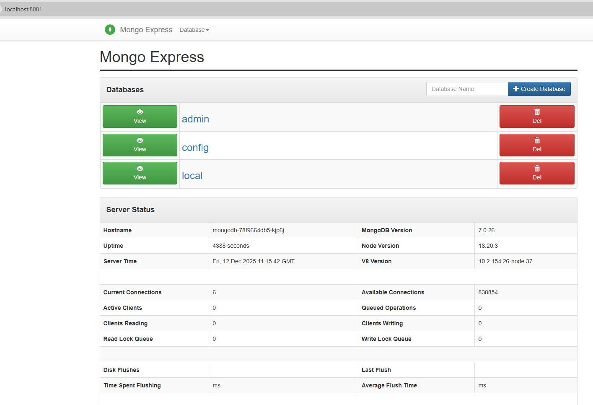
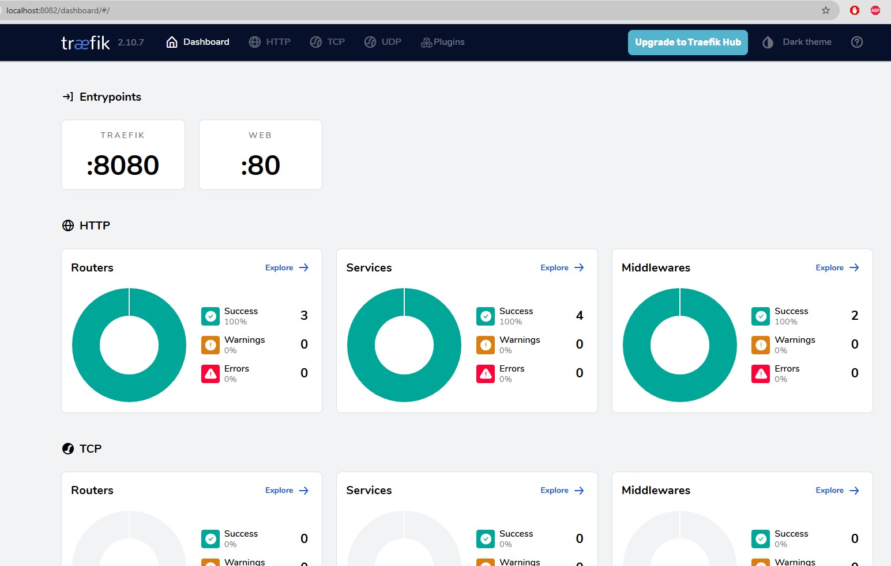

# Инструкция по развертыванию в WSL (Windows Subsystem for Linux)

Пошаговое руководство по развертыванию веб-приложения с MongoDB 
и Traefik Ingress Controller в Kubernetes кластере на базе Minikube в WSL.

📖 **[← Вернуться к описанию проекта (README.MD)](README.MD)**  
📖 **[Развертывание в стандартном кластере (DEPLOY.MD)](DEPLOY.MD)**

## Оглавление

- [Предварительные требования](#предварительные-требования)
- [Шаг 1: Проверка установленных компонентов](#шаг-1-проверка-установленных-компонентов)
- [Шаг 2: Проверка статуса кластера](#шаг-2-проверка-статуса-кластера)
- [Шаг 3: Развертывание приложения](#шаг-3-развертывание-приложения)
- [Шаг 4: Проверка развертывания](#шаг-4-проверка-развертывания)
- [Шаг 5: Настройка доступа через port-forward](#шаг-5-настройка-доступа-через-port-forward)
- [Шаг 6: Тестирование приложения](#шаг-6-тестирование-приложения)
- [Особенности работы в WSL](#особенности-работы-в-wsl)
- [Полезные команды](#полезные-команды)
- [Удаление развертывания](#удаление-развертывания)

---

## Предварительные требования

1. **Windows 10/11** с установленным **WSL 2**
2. **Minikube** установлен в WSL
3. **kubectl** установлен в WSL
4. **PowerShell** на Windows (для port-forward)

## Шаг 1: Проверка установленных компонентов

Из PowerShell выполните команды для проверки версий:

```powershell
# Проверка версии Minikube
wsl minikube version

# Ожидаемый вывод:
# minikube version: v1.37.0
# commit: 65318f4cfff9c12cc87ec9eb8f4cdd57b25047f3
```

```powershell
# Проверка версии kubectl
wsl kubectl version --client

# Ожидаемый вывод:
# Client Version: v1.34.3
# Kustomize Version: v5.7.1
```

## Шаг 2: Проверка статуса кластера

### 2.1. Проверка статуса Minikube

```powershell
wsl minikube status

# Ожидаемый вывод:
# minikube
# type: Control Plane
# host: Running
# kubelet: Running
# apiserver: Running
# kubeconfig: Configured
```

Если кластер не запущен, запустите его:

```powershell
wsl minikube start
```

### 2.2. Проверка доступности кластера

```powershell
# Информация о кластере
wsl kubectl cluster-info

# Список нод
wsl kubectl get nodes

# Ожидаемый вывод:
# NAME       STATUS   ROLES           AGE   VERSION
# minikube   Ready    control-plane   XXm   v1.34.0
```

## Шаг 3: Развертывание приложения

Все манифесты находятся в директории `deploy/`. Применяем их одной командой:

```powershell
wsl kubectl apply -f /mnt/d/OSPanel/domains/ga_kubernetes/deploy/
```

**Примечание:** Путь `/mnt/d/OSPanel/domains/ga_kubernetes/` - это Windows путь `D:\OSPanel\domains\ga_kubernetes\` в формате WSL. Замените на ваш путь к проекту.

Ожидаемый вывод:
```
namespace/webapp created
deployment.apps/mongodb created
service/mongodb created
deployment.apps/webapp created
service/webapp created
serviceaccount/traefik created
clusterrole.rbac.authorization.k8s.io/traefik created
clusterrolebinding.rbac.authorization.k8s.io/traefik created
deployment.apps/traefik created
service/traefik created
ingressclass.networking.k8s.io/traefik created
ingress.networking.k8s.io/webapp-ingress created
```

## Шаг 4: Проверка развертывания

### 4.1. Проверка всех ресурсов в namespace webapp

```powershell
wsl kubectl get all -n webapp
```

Ожидаемый вывод:
```
NAME                           READY   STATUS    RESTARTS   AGE
pod/mongodb-78f9664db5-xxxxx   1/1     Running   0          XXm
pod/webapp-549b87c4bb-xxxxx    1/1     Running   0          XXm
pod/webapp-549b87c4bb-xxxxx    1/1     Running   0          XXm

NAME              TYPE        CLUSTER-IP      EXTERNAL-IP   PORT(S)     AGE
service/mongodb   ClusterIP   10.xx.xxx.xxx   <none>        27017/TCP   XXm
service/webapp    ClusterIP   10.xx.xxx.xxx   <none>        80/TCP      XXm

NAME                      READY   UP-TO-DATE   AVAILABLE   AGE
deployment.apps/mongodb   1/1     1            1           XXm
deployment.apps/webapp    2/2     2            2           XXm
```

### 4.2. Проверка Traefik Ingress Controller

```powershell
wsl kubectl get all -n kube-system -l app=traefik
```

Ожидаемый вывод:
```
NAME                           READY   STATUS    RESTARTS   AGE
pod/traefik-857d9b9688-xxxxx   1/1     Running   0          XXm
pod/traefik-857d9b9688-xxxxx   1/1     Running   0          XXm

NAME                      READY   UP-TO-DATE   AVAILABLE   AGE
deployment.apps/traefik   2/2     2            2           XXm
```

### 4.3. Проверка Ingress

```powershell
wsl kubectl get ingress -n webapp
```

Ожидаемый вывод:
```
NAME             CLASS     HOSTS          ADDRESS   PORTS   AGE
webapp-ingress   traefik   webapp.local             80      XXm
```

### 4.4. Проверка Service Traefik

```powershell
wsl kubectl get service -n kube-system traefik
```

Ожидаемый вывод:
```
NAME      TYPE       CLUSTER-IP      EXTERNAL-IP   PORT(S)                       AGE
traefik   NodePort   10.xx.xxx.xxx   <none>        80:30080/TCP,8080:30081/TCP   XXm
```

### 4.5. Проверка подов с детальной информацией

```powershell
# Поды приложения
wsl kubectl get pods -n webapp -o wide

# Поды Traefik
wsl kubectl get pods -n kube-system -l app=traefik -o wide
```

## Шаг 5: Настройка доступа через port-forward

⚠️ **Важно:** В WSL с Minikube прямой доступ к NodePort (30080, 30081) недоступен из-за особенностей сетевого стека. Используется **port-forward** для проброса портов.

### 5.1. Port-forward для Mongo Express (основное приложение)

Запустите в фоновом режиме:

```powershell
Start-Process wsl -ArgumentList "kubectl port-forward -n webapp svc/webapp 8081:80" -WindowStyle Hidden
```

Теперь приложение доступно по адресу: **http://localhost:8081**

### 5.2. Port-forward для Traefik (HTTP endpoint)

```powershell
Start-Process wsl -ArgumentList "kubectl port-forward -n kube-system svc/traefik 8080:80" -WindowStyle Hidden
```

Теперь Traefik доступен по адресу: **http://localhost:8080**

### 5.3. Port-forward для Traefik Dashboard

```powershell
Start-Process wsl -ArgumentList "kubectl port-forward -n kube-system svc/traefik 8082:8080" -WindowStyle Hidden
```

Теперь Dashboard доступен по адресу: **http://localhost:8082/dashboard/**

## Шаг 6: Тестирование приложения

### 6.1. Тестирование Mongo Express через браузер

1. Откройте браузер
2. Перейдите на: **http://localhost:8081**
3. Введите credentials:
   - Username: `admin`
   - Password: `pass`
4. Должен открыться веб-интерфейс Mongo Express



### 6.2. Тестирование через PowerShell

```powershell
# Проверка без авторизации (должен вернуть 401)
curl http://localhost:8081 -UseBasicParsing -Method Head

# Проверка с авторизацией (должен вернуть 200)
$pair = "admin:pass"
$bytes = [System.Text.Encoding]::ASCII.GetBytes($pair)
$base64 = [System.Convert]::ToBase64String($bytes)
$headers = @{Authorization="Basic $base64"}
(Invoke-WebRequest -Uri http://localhost:8081 -Headers $headers -UseBasicParsing).StatusCode
```

Ожидаемый результат: `200`

### 6.3. Проверка Traefik Dashboard

```powershell
# Открыть в браузере
Start-Process "http://localhost:8082/dashboard/"

# Или проверить через PowerShell
(Invoke-WebRequest -Uri http://localhost:8082/dashboard/ -UseBasicParsing).StatusCode
```

Ожидаемый результат: `200`



### 6.4. Проверка логов

```powershell
# Логи MongoDB
wsl kubectl logs -n webapp -l app=mongodb --tail=50

# Логи веб-приложения
wsl kubectl logs -n webapp -l app=webapp --tail=50

# Логи Traefik
wsl kubectl logs -n kube-system -l app=traefik --tail=50
```

## Особенности работы в WSL

### Почему не работает прямой доступ к NodePort?

В WSL с Minikube IP адрес кластера (обычно 192.168.49.2) находится в изолированной сети Docker и недоступен напрямую из Windows. Это особенность работы Docker driver в Minikube на WSL.

**Решения:**
1. ✅ **Port-forward** (рекомендуется) - используется в этой инструкции
2. **Minikube tunnel** - требует запуска в отдельном терминале с правами администратора
3. **NodePort через WSL IP** - сложная настройка сетевых маршрутов

### Остановка port-forward процессов

Чтобы остановить фоновые процессы port-forward:

```powershell
# Найти все процессы wsl с kubectl port-forward
Get-Process | Where-Object {$_.ProcessName -eq "wsl"} | Select-Object Id, ProcessName

# Остановить конкретный процесс (замените XXXX на ID процесса)
Stop-Process -Id XXXX
```

Или просто перезапустите терминал PowerShell.

## Полезные команды

### Мониторинг

```powershell
# Статус всех ресурсов
wsl kubectl get all -n webapp
wsl kubectl get all -n kube-system -l app=traefik

# События в namespace
wsl kubectl get events -n webapp --sort-by='.lastTimestamp'

# Просмотр endpoints
wsl kubectl get endpoints -n webapp
```

### Диагностика

```powershell
# Детальная информация о Ingress
wsl kubectl describe ingress -n webapp webapp-ingress

# Детальная информация о поде
wsl kubectl describe pod -n webapp <POD_NAME>

# Проверка IngressClass
wsl kubectl get ingressclass
```

### Перезапуск компонентов

```powershell
# Перезапуск веб-приложения
wsl kubectl rollout restart deployment -n webapp webapp
wsl kubectl rollout status deployment -n webapp webapp

# Перезапуск MongoDB
wsl kubectl rollout restart deployment -n webapp mongodb

# Перезапуск Traefik
wsl kubectl rollout restart deployment -n kube-system traefik
```

### Масштабирование

```powershell
# Увеличить количество реплик веб-приложения
wsl kubectl scale deployment -n webapp webapp --replicas=3

# Уменьшить до 1
wsl kubectl scale deployment -n webapp webapp --replicas=1
```

## Удаление развертывания

### Вариант 1: Удалить все ресурсы

```powershell
wsl kubectl delete -f /mnt/d/OSPanel/domains/ga_kubernetes/deploy/
```

### Вариант 2: Удалить namespace (удалит все ресурсы внутри)

```powershell
wsl kubectl delete namespace webapp
```

### Вариант 3: Полное удаление включая Traefik

```powershell
# Удалить все ресурсы приложения
wsl kubectl delete -f /mnt/d/OSPanel/domains/ga_kubernetes/deploy/

# Удалить Traefik компоненты
wsl kubectl delete deployment -n kube-system traefik
wsl kubectl delete service -n kube-system traefik
wsl kubectl delete clusterrolebinding traefik
wsl kubectl delete clusterrole traefik
wsl kubectl delete serviceaccount -n kube-system traefik
wsl kubectl delete ingressclass traefik
```

### Остановка кластера Minikube

```powershell
# Остановить кластер (сохранить состояние)
wsl minikube stop

# Удалить кластер полностью
wsl minikube delete
```

---

## Итоговая проверка

После успешного развертывания у вас должно быть:

✅ Namespace `webapp` создан  
✅ MongoDB запущена (1 replica)  
✅ Веб-приложение запущено (2 replicas)  
✅ Traefik Ingress Controller запущен (2 replicas)  
✅ Ingress настроен для домена `webapp.local`  
✅ Port-forward туннели настроены  
✅ Приложение доступно на **http://localhost:8081** (admin/pass)  
✅ Traefik Dashboard доступен на **http://localhost:8082/dashboard/**  
✅ MongoDB принимает подключения от веб-приложения  

---

## Дополнительные материалы

📖 **[← Вернуться к описанию проекта (README.MD)](README.MD)**  
📋 **[Инструкция по развертыванию (стандартная) (DEPLOY.MD)](DEPLOY.MD)**  
📋 **[Все команды для копирования (cmds.sh)](cmds.sh)**  
📁 **[Манифесты Kubernetes (deploy/)](deploy/)**

---

**Примечание:** 
Данные в MongoDB хранятся в `emptyDir` и будут потеряны при удалении пода. 
Это соответствует требованиям задания **"Nightmare"**.

---

**Автор:** Иконников Михаил <mishaikon@gmail.com>
